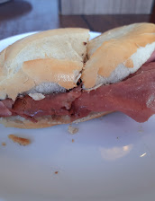
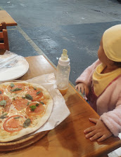
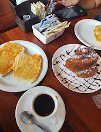
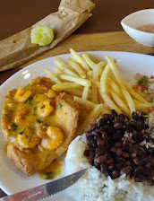
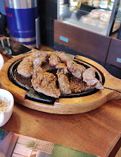
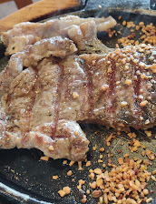
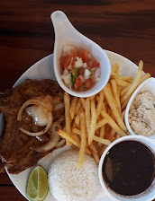

index.html
<!DOCTYPE html>
<html lang="pt-BR">
<head>
  <meta charset="UTF-8">
  <title>Trem Bão Deli</title>
  
</head>
<body>

<header>
  <h1>Trem Bão Deli</h1>
  
Comida boa, bem servida e com gosto de casa

</header>

<section class="galeria">
  
  
  
  
  
  
  
  
</section>

<footer>
  
Av. Embaixador Abelardo Bueno, 3050 – Barra Olímpica – RJ

  
© Trem Bão Deli

</footer>

</body>
</html>
